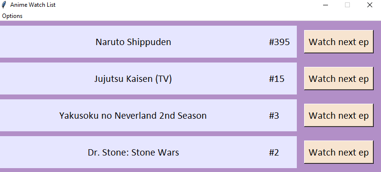

# Anime Watch List
GUI based on the gogoanime website in which you can keep track of the anime you are watching and easily see if a new episode is released.

All you need to do is add the URLs of the anime you want to watch in the config.txt file and run the application.

Download the latest release for Windows from [here](https://github.com/ahmed91abbas/anime-watch-list/releases/latest).

Download the required packages:

        pip3 install -r requirements.txt

Run the application with:

        python3 anime_watch_list.py

Build the executable with:

        python3 build_executable.py

`pyinstaller version used: 5.0.dev0`
