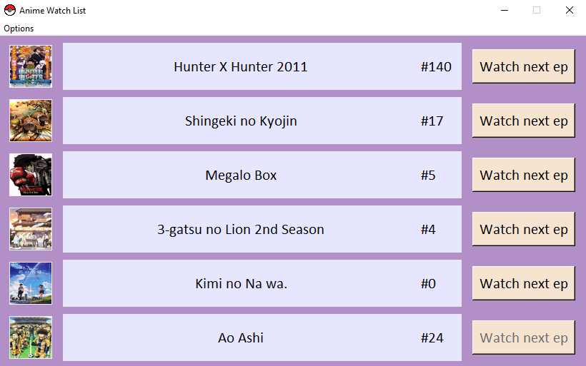
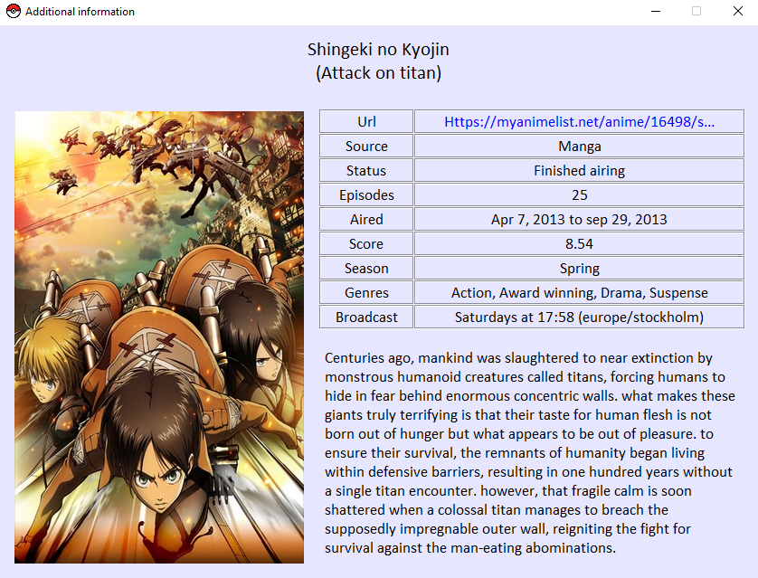

# Anime Watch List
GUI based on the gogoanime (anitaku) website in which you can keep track of the anime you are watching and easily see if a new episode is released.

All you need to do is add the URLs of the anime you want to watch in the configs/config.txt file and run the application.

<b>Download the latest release for Windows from [here](https://github.com/ahmed91abbas/anime-watch-list/releases/latest).</b>

You can also view more information about any anime by clicking the picture to the left. The information is fetched from [myanimelist.net](https://myanimelist.net/)

### To run locally, follow these steps:

Download the required packages:

        pip3 install -r requirements.txt

Run the application with:

        python3 anime_watch_list.py

Build the executable with:

        python3 build_executable.py

`Python version used: 3.12.4`
